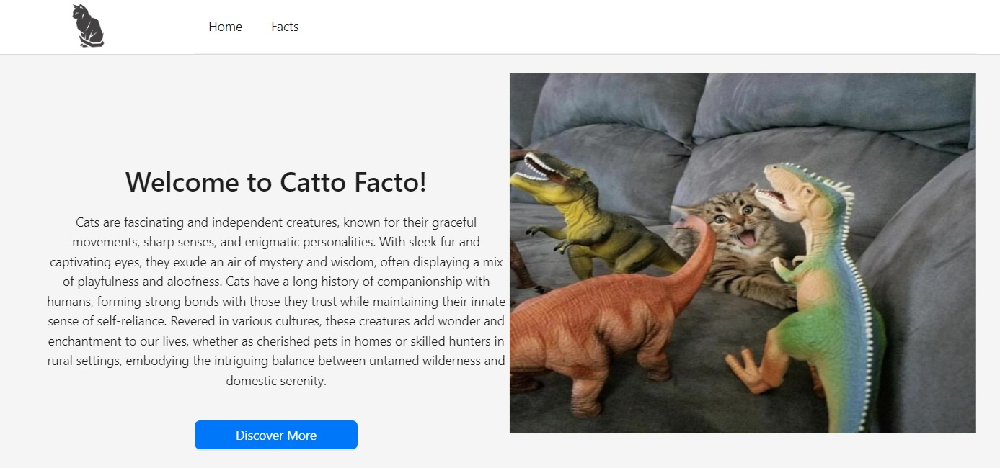
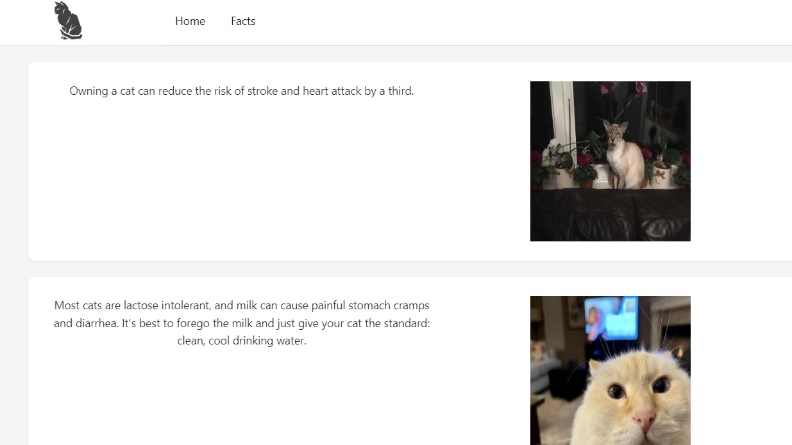

# **CATTO-FACTO**

## Introduction

Cats are intriguing and independent creatures known for their graceful movements, enigmatic personalities, and sharp senses. They form strong bonds with humans while retaining their self-reliance. Revered in various cultures, they add wonder and enchantment as pets or hunters, embodying the balance between untamed wilderness and domestic companionship.
This app is dedicated to our favourite feline companions!

## The App

This app takes 2 APIs, Cat Facts for facts and Cataas for random cat pictures, and merge them onto a platform.

**Home Page**

This is the front page with basic information and the discover button to go to facts.

**Facts Page**
This is the facts page with some facts and pictures of cats.

## Languages and Technologies

* HTML
* CSS
* Javascript
* React
* Netlify
* Ant Design

## Further Improvements

* Add the option for users to add in their own facts
* Add a save fact function

## APIs Used

* https://cat-fact.herokuapp.com/#/
* https://cataas.com/cat

If you like cats, this is the site for you!
If you prefer dogs, we have a link to another site for you to enjoy!
